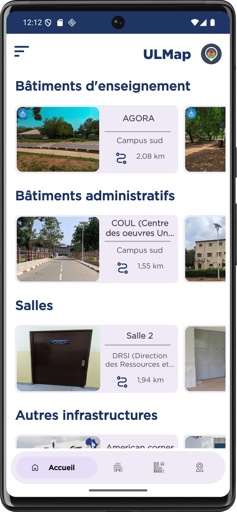
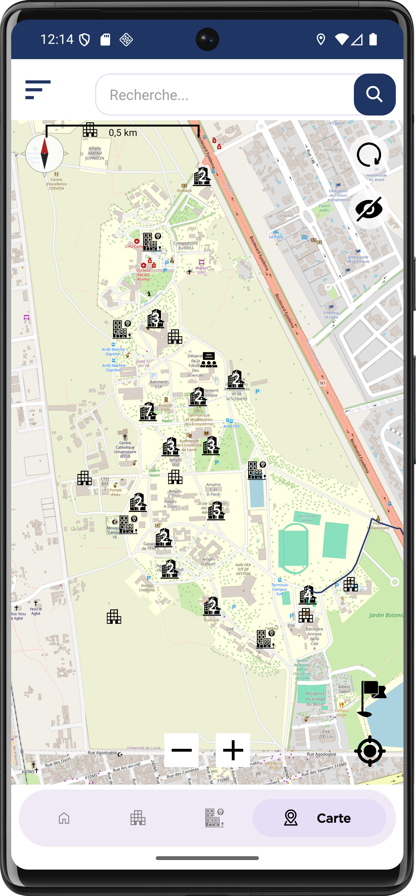
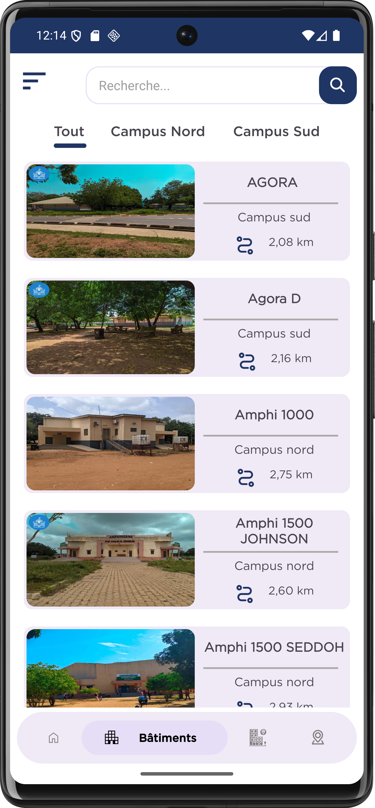
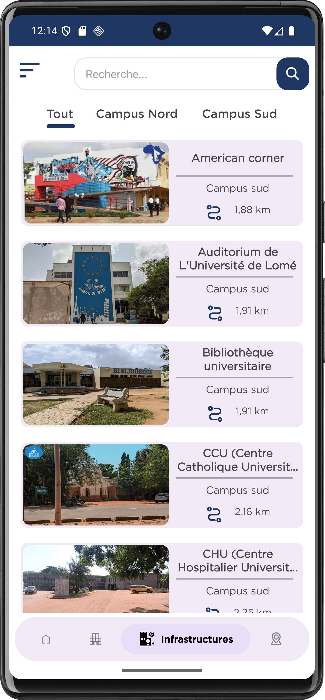
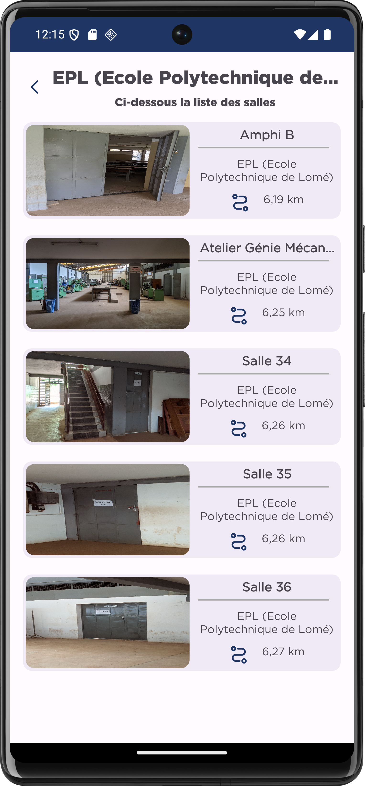

# 📍 ULMap

Application mobile de géolocalisation des infrastructures de l’Université de Lomé

Application ULMap (nom du dépôt : LocUL)

## 📖 Description

ULMap est une application mobile Android conçue pour faciliter l’orientation et la localisation des infrastructures universitaires sur le campus de l’Université de Lomé. Elle s’adresse aux étudiants, enseignants, personnels administratifs, visiteurs et nouveaux arrivants, en leur permettant de trouver rapidement un bâtiment, une salle ou une infrastructure grâce à une carte interactive et des itinéraires précis.

Ce projet s’inscrit dans une démarche d’amélioration de l’expérience utilisateur sur le campus universitaire à travers les technologies mobiles et la géolocalisation.

## ✨ Fonctionnalités principales

- 🗺️ Affichage du campus sur une carte interactive
- 📍 Géolocalisation des bâtiments et infrastructures universitaires
- 🔍 Recherche par nom des bâtiments, salles et autres infrastructures
- 🏫 Consultation des détails d’un bâtiment, d'une infrastructure ou d’une salle
- 🧭 Traçage d’itinéraire vers une destination depuis la position de l'utilisateur
- 🌙 Mode clair / mode sombre
- 🌍 Interface multilingue (Français / Anglais)
- 📱 Interface intuitive adaptée aux appareils Android

## 🖼️ Aperçu de l’application

## 🛠️ Technologies utilisées

- Langage : Kotlin
- IDE : Android Studio
- Cartographie : OSMDroid (OpenStreetMap)
- Base de données : Firebase Firestore
- Architecture UI : Activities & Fragments
- Composants : RecyclerView, DrawerLayout
- Backend Web (administration) : PHP (sur un autre repository)

## ⚙️ Installation et configuration

### Prérequis

- Android Studio (version récente recommandée)
- SDK Android configuré
- Connexion Internet (pour les cartes et Firebase)

### Étapes d’installation

1. Cloner le dépôt à l'adresse : [Repository link](https://github.com/sicyrillewilson/LocUL.git)
2. Ouvrir le projet dans Android Studio
3. Synchroniser les dépendances Gradle
4. Lancer l’application sur un émulateur ou un appareil réel

### Permissions requises

- Accès à la localisation (GPS)
- Accès à Internet

## ▶️ Utilisation

1. Lancer l’application
2. Autoriser l’accès à la localisation
3. Naviguer via le menu latéral
4. Rechercher un bâtiment ou une infrastructure
5. Consulter les détails et afficher l’itinéraire

## 📦 Releases

- v1.0.0 – Première version stable (Nov 11, 2025)
- v1.0.1 – Corrections et améliorations mineures

👉 Releases disponibles ici :
[Releases link](https://github.com/sicyrillewilson/LocUL/releases)

## 🧩 Architecture de l’application

L’application repose sur une architecture modulaire facilitant la navigation et la maintenance :

- Activities : gestion des écrans principaux
- Fragments : affichage dynamique des sections (Accueil, Carte, Bâtiments, Infrastructures)
- RecyclerView & Adapters : affichage des listes
- Firebase Firestore : stockage et synchronisation des données
- OSMDroid : affichage cartographique et gestion de la géolocalisation

## 🌐 Application Web d’administration

La gestion des données (bâtiments, salles, infrastructures) se fait via
une application web d’administration disponible sur un dépôt séparé :

👉 [Repository admin](https://github.com/crepin7/admin-site.git)

⚠️ Cette application est destinée exclusivement à l’administration du système.
L’accès est restreint aux utilisateurs autorisés.
Le dépôt est public à des fins académiques et de transparence technique.

## 🤝 Contribution

Toutes les contributions sont les bienvenues.

## 👤 Auteurs

1. Adjé Sitou Jean Cyrille WILSON-BAHUN : Chef Projet
2. Gabriel ATUAKUMA 
3. Crépin AZIAMADJI
4. Steeve KAMDE 
5. Thibaute ZODIHOE

## 📄 Licence

Ce projet est distribué sous licence MIT. 
Vous êtes libre de l’utiliser, le modifier et le redistribuer dans le respect des termes de la licence.

